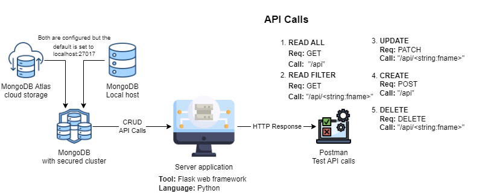

# Hulu Data Catalog

The web application is built using the Flask web framework on the 
server-side and MongoDB as the database. Flask is a lightweight web 
framework written in Python, which allows for the creation of web 
applications quickly and easily.

MongoDB uses a document-based model, which allows for the 
storage and retrieval of data in a flexible manner. The application 
uses the Hulu dataset, which contains information about movies 
and TV shows available on the Hulu streaming platform.

The web application allows users to perform various tasks, 
such as creating, reading, updating, and deleting records based on 
different criteria, such as genre, release year, and rating.

# Architecture


# Tasks Accomplished
- [x] Initialise Flask web framework.
- [x] Initialise Mongo database
    * Host: 'localhost'
    * Port: '27017'
    * Database name: 'database'
    * Collection name: 'collection'
- [x] API Calls<br>
    * GET (list all records)
    * GET (list record by 'title' field)
    * PATCH (Update record)
    * POST (Create new record)
    * DELETE (Delete record by 'title')

> The above mentioned API Calls are well defined and executed locally.<br>
> All the outputs are saved in [output directory](https://github.com/bhavesh-asana/HuluStream/tree/main/outputs).

# How to run the code?
## On Windows OS
1. Open command prompt and choose a directory to clone this repository
   ```commandline
    git clone https://github.com/bhavesh-asana/HuluStream.git
   ```
2. Go to the project directory, create a virtual environment and install the dependencies
   from the requirements.txt file.
    ```commandline
     cd HuluStream
   
     # Create virtual environment (.venv)
     python -m venv .venv
     .\.venv\Scripts\activate.bat       # activate .venv
     pip install -U pip                 # upgrade pip package
     pip install -r requirements.txt    # install dependencies
    ```
3. Open command prompt and run the following command to start the flask application
   ```commandline
    flask run
   ```

---

# :technologist: Developer

**Student Name :** Bhavesh Asanabada<br>
**Course       :** Computer Science<br>
**ID Number    :** 700744873
